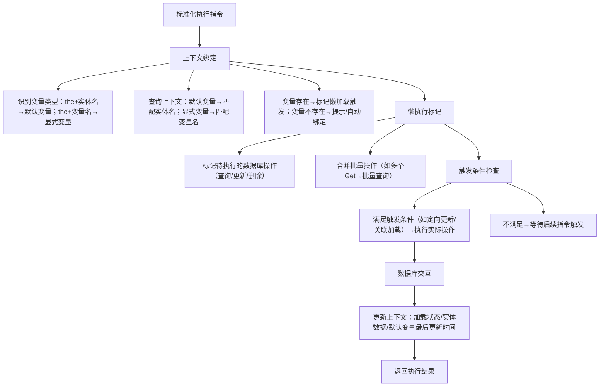

# 自然语言数据库操作DSL设计文档（终极完整版）
## 一、文档概述
### 1.1 核心设计目标
- **语法自然性**：100%符合英语语法规则，通过`a/an/the`精准区分实体类型（新单实体/已绑定变量实体），`[]`仅用于复数场景严格确认实体名；
- **解析可控性**：明确关键字/省略规则/兼容语法，解析器可精准识别语义，无歧义；
- **执行高效性**：引入懒加载、懒查找等执行器策略，减少无效数据库交互，支持已获取实体的定向修改；
- **变量便捷性**：`Get`操作未显式命名时自动生成默认变量，`the + 实体名`可指向最后获取的该类实体；
- **双层兼容性**：自然版（语法完整）+ 兼容版（极简简洁），解析/执行结果一致。

### 1.2 核心语义约定
| 标识/冠词 | 核心语义 | 使用场景 | 示例 |
|-----------|----------|----------|------|
| `a/an` | 指代“未绑定上下文的新单实体”，需通过`by id`/`where`定位 | 新增/更新/删除未命名的单实体 | `Update a user by id of 1 to set name to 李四_修改` |
| `the` | 指代“已通过`Get`获取的实体（显式命名变量/默认生成变量）”，无需定位条件 | 定向修改/删除已获取的实体 | `Update the user to set name to 李四`（默认变量）、`Update the user1 to set name to 李四`（显式变量） |
| 复数实体名（如`users`） | 指代“某类实体的全部/批量” | 批量更新/删除/查询 | `Update users to set status to active` |
| `[实体名]` | 仅复数场景使用，严格确认实体名（避免复数歧义），无其他语义 | 复数实体名存在歧义时 | `Update [user]s to set status to active`（明确是user的复数，非独立users实体） |

## 二、核心语法规则
### 2.1 基础通用规则
| 规则项 | 详细说明 |
|--------|----------|
| 冠词规则 | 1. `a/an`：必选，用于“新单实体”（未绑定上下文），按后续名词发音选择（`a user`/`an issue`），需搭配`by id`/`where`定位；<br>2. `the`：必选，用于“已绑定上下文的实体”，后接①`Get`显式命名的变量（如`user1`）②`Get`未命名时默认生成的实体名（如`user`），无需定位条件；<br>3. 复数实体名：无冠词，指代“全部/批量实体”，`[]`仅此时使用（严格确认实体名）；<br>4. 字段前`a/an`：可选，仅贴合发音习惯，解析时自动过滤 |
| 单复数规则 | 1. 自然完整版：单实体用单数（`a user`）、批量/全部用复数（`users`/`[user]s`）；<br>2. AI流程：语法器处理规则内复数（`user→users`），AI仅处理特殊复数（`child→children`/`sheep`）；<br>3. 兼容版：支持复数省略，解析时自动补全 |
| `[]`使用规则 | 1. 唯一作用：复数场景严格确认实体名，避免歧义（如`[user]s`≠`users`）；<br>2. 写法：`[实体名] + 复数后缀`（`[user]s`），解析时删除`[]`，保留实体名+复数；<br>3. 非复数场景禁止使用`[]` |
| 变量默认生成规则 | 1. `Get`操作未显式指定`as [变量名]`时，自动生成与实体名同名的默认变量；<br>2. 默认变量仅存储“最后一次`Get`的该类单实体”，批量`Get`（复数）不生成默认变量；<br>3. `the + 实体名`优先匹配该默认变量，实现无命名定向修改 |
| 关键词规则 | 1. `to`：仅用于更新操作，表“更新动作的目的”（不定式搭配动词原形）；<br>2. `and`：仅用于多字段/多关联并列，无其他语义；<br>3. `where/is`/`set/to`/`with`/`from`：语义唯一，无冲突；<br>4. `as`：显式命名变量时必选，未命名时省略（自动生成默认变量） |
| 兼容规则 | 字段前`a/an`、字段-值间`of`、更新操作`to`、列表实体复数均为可选省略项，解析/执行结果一致 |

### 2.2 细分语法（自然完整版，100%符合英语语法）
#### 2.2.1 查询操作（支持默认变量生成）
| 操作场景 | 自然完整版句式 | 示例（纯自然语法） | 执行器行为（默认变量生成） |
|----------|----------------|--------------------|----------------------|
| 单实体查询（未命名，生成默认变量） | `Get a/an [单数实体名] by id of [数值]` | `Get a user by id of 1` | 仅记录查询条件，不立即查库，上下文生成默认变量`user`（存储最后一次Get的user实体），标记为“待加载” |
| 单实体条件查询（未命名，生成默认变量） | `Get a/an [单数实体名] where [字段] is [值]` | `Get an issue where status is 未解决` | 同上，上下文生成默认变量`issue` |
| 单实体查询（显式命名） | `Get a/an [单数实体名] by id of [数值] as [变量名]` | `Get a user by id of 1 as user1` | 记录查询条件，上下文标记`user1`为“待加载”，默认变量`user`同步更新为该实体 |
| 列表查询（批量，不生成默认变量） | `Get [复数实体名/[实体名]s] where [字段] is [值]` | `Get users where sex is 1`、`Get [user]s where age > 18` | 记录批量查询条件，不生成默认变量（复数无默认变量） |
| 全量查询（不生成默认变量） | `Get all [复数实体名/[实体名]s]` | `Get all tags`、`Get all [tag]s` | 记录全量查询条件，不生成默认变量 |

#### 2.2.2 新增操作（单实体，无默认变量）
| 操作场景 | 自然完整版句式 | 示例（纯自然语法） |
|----------|----------------|--------------------|
| 单字段新增 | `Create a/an [单数实体名] with a/an [字段] of [值]` | `Create a user with a name of 李四`、`Create a user with an age of 18` |
| 多字段新增 | `Create a/an [单数实体名] with a/an [字段1] of [值1] and a/an [字段2] of [值2]` | `Create a user with a name of 李四 and an age of 18` |
| 新增并绑定变量 | `Create a/an [单数实体名] with a/an [字段] of [值] as [变量名]` | `Create a user with an email of test@xxx.com as newUser` |

#### 2.2.3 更新操作（支持`the + 默认变量/显式变量`）
| 操作场景 | 自然完整版句式 | 示例（纯自然语法） | 执行器行为（懒查找） |
|----------|----------------|--------------------|----------------------|
| 新单实体更新（需定位） | `Update a/an [单数实体名] by id of [数值] to set [字段] to [值]` | `Update a user by id of 1 to set name to 李四_修改` | 检查上下文无该实体，直接执行定位+更新 |
| 已获取实体更新（默认变量，定向） | `Update the [实体名] to set [字段] to [值]` | `Update the user to set name to 李四` | 先检查上下文默认变量`user`：未加载则触发懒加载，再执行更新 |
| 已获取实体更新（显式变量，定向） | `Update the [变量名] to set [字段] to [值]` | `Update the user1 to set name to 李四` | 检查上下文`user1`：未加载则触发懒加载，再执行更新 |
| 批量更新（无歧义） | `Update [复数实体名] to set [字段] to [值]` | `Update users to set status to active` | 批量更新全部user实体 |
| 批量更新（严格确认） | `Update [实体名]s to set [字段] to [值]` | `Update [user]s to set status to active` | 明确更新user的复数，避免`users`歧义 |
| 多字段定向更新（默认变量） | `Update the [实体名] to set [字段1] to [值1] and [字段2] to [值2]` | `Update the user to set name to 李四 and age to 19` | 触发默认变量`user`懒加载（如需）后，执行多字段更新 |

#### 2.2.4 删除操作（支持`the + 默认变量/显式变量`）
| 操作场景 | 自然完整版句式 | 示例（纯自然语法） | 执行器行为（懒查找） |
|----------|----------------|--------------------|----------------------|
| 新单实体删除（需定位） | `Delete a/an [单数实体名] by id of [数值]` | `Delete a tag by id of 3` | 直接执行定位+删除 |
| 已获取实体删除（默认变量） | `Delete the [实体名]` | `Delete the user` | 检查上下文默认变量`user`：未加载则触发懒加载，再删除 |
| 已获取实体删除（显式变量） | `Delete the [变量名]` | `Delete the user1` | 检查上下文`user1`：未加载则触发懒加载，再删除 |
| 批量删除（严格确认） | `Delete [实体名]s` | `Delete [user]s` | 明确删除user的复数，避免歧义 |

#### 2.2.5 关联加载操作（基于默认/显式变量）
| 操作场景 | 自然完整版句式 | 示例（纯自然语法） | 执行器行为 |
|----------|----------------|--------------------|------------|
| 单关联加载（默认变量） | `Get [复数关联实体名] from the [实体名] as [关联变量名]` | `Get tags from the user as userTags` | 触发默认变量`user`懒加载后，加载关联的tags并绑定变量 |
| 单关联加载（显式变量） | `Get [复数关联实体名] from the [变量名] as [关联变量名]` | `Get tags from the user1 as user1Tags` | 触发`user1`懒加载后，加载关联的tags并绑定变量 |
| 多关联加载（默认变量） | `Get [复数关联实体名1] as [名1] and [复数关联实体名2] as [名2] from the [实体名]` | `Get tags as userTags and issues as userIssues from the user` | 加载多类关联实体并分别绑定变量 |

### 2.3 兼容版语法（极简简洁，兜底使用）
兼容版支持省略冗余词/冠词（`the`除外，需保留语义）/复数，解析器自动归一化为自然版逻辑，示例如下：

| 操作类型 | 自然完整版 | 兼容版（极简） | 解析归一化结果 |
|----------|--------------------|----------------|----------------|
| 默认变量定向更新 | `Update the user to set name to 李四` | `Update the user set name to 李四` | `Update the user to set name to 李四` |
| 显式变量定向更新 | `Update the user1 to set name to 李四` | `Update the user1 set name to 李四` | `Update the user1 to set name to 李四` |
| 新单实体更新 | `Update a user by id of 1 to set name to 李四_修改` | `Update a user by id 1 set name to 李四_修改` | `Update a user by id of 1 to set name to 李四_修改` |
| 批量更新（严格） | `Update [user]s to set status to active` | `Update [user] set status to active` | `Update [user]s to set status to active` |

## 三、解析器策略
### 3.1 关键字定义（核心/可选）
| 关键字类型 | 包含关键字 | 语义 | 是否可省略 |
|------------|------------|------|------------|
| 核心关键字（必选） | `Get/Create/Update/Delete` | 操作类型标识 | 否 |
| 核心关键字（必选） | `where/is/set/to/from/as` | 条件/字段/变量/关联标识 | 否（`as`仅显式命名时必选，未命名时省略） |
| 核心关键字（必选） | `a/an/the` | 实体类型标识（`the`仅变量实体必选） | 否（`a/an`单实体必选，`the`变量/默认实体必选） |
| 可选关键字（冗余） | `of/by` | 定位/字段值限定 | 是（解析时自动补全） |
| 可选关键字（冗余） | `to`（更新动作） | 不定式表目的 | 是（解析时自动补全） |
| 实体标识（特殊） | `[]` | 复数实体名严格确认 | 仅复数歧义时需用，否则可省略 |

### 3.2 省略规则
1. **定位冗余词省略**：`by id of [数值]`可省略`of`，解析为`by id of [数值]`；
2. **字段冗余词省略**：`with a name of 李四`可省略`a/of`，解析为`with a name of 李四`；
3. **更新动作`to`省略**：`Update the user set name to 李四`可省略`to`，解析为`Update the user to set name to 李四`；
4. **复数省略**：兼容版可省略复数后缀，解析器自动补全（如`Get user`→`Get users`）；
5. **`the`不可省略**：`the`是变量/默认实体的核心标识，省略后解析器自动补全并警告；
6. **`as`省略规则**：`Get`操作未显式命名时省略`as`，解析器自动标记“生成默认变量”。

### 3.3 解析流程（全链路，新增默认变量解析）
```mermaid
graph TD
    A[接收指令] --> B[分词与归一化]
    B --> B1[转小写+过滤无效空格]
    B --> B2[补全省略的核心关键字（of/to/复数）]
    B --> B3[识别`[]`并提取纯实体名（如[user]s→user）]
    C[冠词/实体类型解析] --> C1[识别`a/an`→新单实体，标记需定位]
    C --> C2[识别`the + 实体名`→默认变量，标记查上下文默认变量]
    C --> C3[识别`the + 变量名`→显式变量，标记查上下文显式变量]
    C --> C4[识别复数/[]→批量实体，标记无定位]
    B --> C
    D[变量规则解析] --> D1[识别`Get`无`as`→标记生成默认变量（实体名同名）]
    D --> D2[识别`Get`有`as`→标记生成显式变量，同步更新默认变量]
    C --> D
    D --> E[关键词锚定与模块划分]
    E --> E1[划分「操作类型/实体/条件/字段/变量」模块]
    E --> E2[校验必选关键字（如set/to/and）]
    E --> F[AI介入（仅规则盲区）]
    F --> F1[特殊复数归一化（child→children）]
    F --> F2[实体歧义判定（如users→提示用[user]s）]
    F --> G[上下文关联校验]
    G --> G1[`the + 实体名`→检查上下文默认变量]
    G --> G2[`the + 变量名`→检查上下文显式变量]
    G --> G3[无变量→提示先执行Get操作或触发懒加载]
    G --> H[生成标准化执行指令]
```

### 3.4 兼容语法处理逻辑
1. 兼容版指令先经过“归一化补全”，转化为自然版语法结构；
2. 补全优先级：核心关键字（`set/to`）> 冗余词（`of/by`）> 复数后缀 > `the`（自动补全并警告）；
3. 补全后执行解析流程，与自然版指令解析结果完全一致；
4. 对`Update the user set name to 李四`这类兼容指令，自动补全`to`并识别为“默认变量定向更新”。

## 四、执行器策略（核心：懒加载/懒查找+默认变量）
### 4.1 核心设计理念
执行器将“指令解析”与“实际数据库操作”解耦，通过**上下文管理**存储显式变量/默认变量，**懒加载/懒查找**减少无效数据库交互；`Get`未命名时自动生成默认变量，实现`the + 实体名`的无命名定向修改。

### 4.2 上下文管理（变量存储，新增默认变量）
#### 4.2.1 上下文结构
| 字段 | 说明 | 示例 |
|------|------|------|
| 变量类型 | 区分“默认变量/显式变量” | 默认变量（user）、显式变量（user1） |
| 变量名 | ① 显式变量：`Get`的`as`命名；② 默认变量：实体名（最后一次Get的单实体） | user（默认）、user1（显式）、allTags（批量，无默认） |
| 实体类型 | 实体的原始名称（去[]/复数） | user、tag、issue |
| 加载状态 | 待加载/已加载/已失效 | 待加载（Get后未执行）、已加载（触发操作后） |
| 关联条件 | Get操作的原始条件（懒加载用） | by id of 1、where sex is 1 |
| 作用域 | 变量生效范围（会话级/全局） | 会话级（默认，会话结束失效） |
| 生命周期 | 变量存活时间（秒） | 300秒（无操作自动失效） |
| 最后更新时间 | 默认变量的最后一次Get操作时间 | 2025-12-18 10:00:00（用于覆盖默认变量） |

#### 4.2.2 上下文操作（新增默认变量规则）
1. **默认变量生成**：
   - `Get`操作无`as`时，生成与实体名同名的默认变量，存储最后一次`Get`的该类单实体条件；
   - 多次`Get`同一类实体（如`Get a user by id of 1`→`Get a user by id of 2`），默认变量覆盖为最后一次的条件；
   - 批量`Get`（复数）不生成/更新默认变量。
2. **显式变量生成**：`Get/Create`带`as`时，生成显式变量，同步更新默认变量为该实体。
3. **变量查询**：
   - `Update/Delete`识别`the + 实体名`→优先匹配上下文默认变量；
   - `Update/Delete`识别`the + 变量名`→匹配上下文显式变量。
4. **变量失效**：会话结束/生命周期超时/实体被删除，标记变量为“已失效”，默认变量清空。

### 4.3 懒加载策略（新增默认变量触发逻辑）
#### 4.3.1 核心逻辑
`Get`指令解析后，**不立即执行数据库查询**，仅将“查询条件+变量类型（默认/显式）”存入上下文，加载状态标记为“待加载”；仅当后续操作（`Update/Delete/Get关联`）触发该变量时，才执行数据库查询并更新加载状态为“已加载”。

#### 4.3.2 触发条件
1. 执行`the + 实体名`（默认变量）的`Update/Delete`操作；
2. 执行`the + 变量名`（显式变量）的`Update/Delete`操作；
3. 执行`from the + 实体名/变量名`的关联加载操作；
4. 主动触发（如指令后加`execute`关键字）；
5. 上下文变量生命周期即将超时（提前加载）。

#### 4.3.3 优势
- 减少无效查询：若`Get`后无后续操作，不执行数据库交互；
- 批量操作优化：多个`Get`指令可合并为一次批量查询，降低数据库压力；
- 变量复用：默认变量/显式变量多次使用仅加载一次，提升效率；
- 无命名便捷性：无需显式命名即可通过`the + 实体名`定向修改最后获取的实体。

### 4.4 懒查找策略（新增默认变量匹配逻辑）
#### 4.4.1 核心逻辑
`Update/Delete`指令识别`the + 实体名/变量名`时，按优先级查找上下文变量：
1. 优先级1：`the + 变量名`→查找显式变量；
2. 优先级2：`the + 实体名`→查找默认变量；
3. 匹配规则：
   - 若存在且加载状态为“已加载”：直接使用实体数据执行操作；
   - 若存在且加载状态为“待加载”：触发该变量的懒加载（执行`Get`的查询条件），再执行操作；
   - 若不存在：提示“未找到该实体的默认/显式变量，请先执行Get操作”或自动执行`Get a/an [实体名] by id/条件`（需配置）。

#### 4.4.2 执行优先级
默认变量/显式变量（已加载） > 默认变量/显式变量（待加载，触发懒加载） > 新实体定位操作（`a/an + by id`） > 批量实体操作（复数/[]）。

### 4.5 执行阶段划分（新增默认变量流程）


### 4.6 触发条件配置
| 触发类型 | 配置项 | 默认值 |
|----------|--------|--------|
| 懒加载触发 | 变量首次使用时触发（默认/显式变量） | 开启 |
| 批量操作触发 | 批量指令（如Update users）立即执行 | 开启 |
| 主动触发 | 指令后加`execute`强制立即执行 | 关闭（需显式指定） |
| 超时触发 | 上下文变量超时前10秒自动加载（默认/显式变量） | 关闭 |
| 默认变量覆盖 | 多次Get同一类实体自动覆盖默认变量 | 开启 |

## 五、AI介入策略（仅规则盲区）
### 5.1 AI触发条件
1. **特殊复数归一化**：语法器无法处理的复数（`child→children`/`sheep`）；
2. **实体歧义判定**：复数实体名存在歧义（如`users`匹配`user`复数/独立`users`实体）；
3. **上下文变量缺失**：`the + 实体名/变量名`无上下文，AI推荐先执行的`Get`指令；
4. **默认变量冲突**：多次`Get`不同类实体但默认变量名重复（如`Get a user`→`Get a tag`，默认变量均为实体名）。

### 5.2 AI输出结果
| 触发场景 | AI输出示例 |
|----------|------------|
| 特殊复数 | `[提示] 指令中的"children"已归一化为"child"，建议使用Get [child]s where age < 18` |
| 实体歧义 | `[警告] "users"存在歧义，可选：1. Update [user]s to set status to active（user复数）；2. Update users to set status to active（独立users实体）` |
| 默认变量缺失 | `[提示] 未找到user的默认变量，建议先执行Get a user by id of 1` |
| 显式变量缺失 | `[提示] 未找到变量user1，建议先执行Get a user by id of 1 as user1` |
| 默认变量冲突 | `[提示] 最后一次Get的是tag实体，默认变量为tag，无法匹配the user，请先执行Get a user` |

## 六、配置文件规范
```json
{
  "parser": {
    "compatible_mode": true, // 开启兼容版语法支持
    "auto_complete_keyword": true, // 自动补全省略的关键字
    "warn_the_omission": true, // 省略the时警告并补全
    "auto_generate_default_var": true // 开启Get未命名时的默认变量生成
  },
  "executor": {
    "lazy_load": true, // 开启懒加载
    "lazy_lookup": true, // 开启懒查找
    "variable_ttl": 300, // 变量生命周期（秒）
    "batch_merge": true, // 开启批量操作合并
    "auto_trigger_load": true, // 变量首次使用时自动触发懒加载
    "default_var_override": true // 多次Get同一类实体覆盖默认变量
  },
  "ai": {
    "enable_ambiguity_check": true, // 开启实体歧义检查
    "enable_special_plural": true, // 开启特殊复数归一化
    "enable_default_var_check": true // 开启默认变量冲突检查
  },
  "persistent_mapping": [
    {"word": "users", "target_entity": "user", "source": "manual_choice"},
    {"word": "children", "target_entity": "child", "source": "ai_auto"}
  ],
  "context": {
    "scope": "session", // 变量作用域（session/global）
    "max_variables": 100, // 上下文最大变量数
    "max_default_vars": 10 // 最大默认变量数（不同实体类）
  }
}
```

## 七、警告与错误处理
### 7.1 警告级别与触发场景
| 级别 | 触发场景 | 处理逻辑 |
|------|----------|----------|
| Error | 1. 单实体操作缺`a/an`（如`Create user with name 李四`）；<br>2. 更新操作缺`set/to`（如`Update a user by id 1 set name 李四`）；<br>3. `the + 实体名/变量名`无上下文且关闭自动绑定；<br>4. 变量名重复；<br>5. 默认变量冲突且无法匹配 | 终止执行，提示修复必选元素/变量 |
| Warning | 1. AI判定实体歧义；<br>2. 省略`the`（自动补全并警告）；<br>3. 变量即将超时（剩余<60秒）；<br>4. 特殊复数未归一化；<br>5. 多次Get不同类实体导致默认变量覆盖 | 不终止执行，输出警告提示 |
| Hint | 1. 大小写混用；<br>2. 兼容版省略冗余词；<br>3. 批量操作未用`[]`（提示歧义风险）；<br>4. Get未命名时提示默认变量生成规则 | 仅输出优化提示，不影响执行 |

### 7.2 错误提示示例
| 错误类型 | 提示文案 |
|----------|----------|
| 缺`a/an` | `[Error] 新增单实体需加a/an（如Create a user with name 李四），请补充后重试` |
| 默认变量缺失 | `[Error] 未找到user的默认变量，无法执行定向更新，请先执行Get a user by id of 1` |
| 显式变量缺失 | `[Error] 上下文未找到变量user1，无法执行定向更新，请先执行Get a user by id of 1 as user1` |
| 省略`the` | `[Warning] 省略变量/默认实体标识the，已自动补全为Update the user set name to 李四，建议显式添加the` |
| 默认变量冲突 | `[Warning] 最后一次Get的是tag实体，默认变量已覆盖为tag，执行Update the user会失败，请重新Get a user` |

## 八、核心优势
1. **语法极致自然**：通过`a/an/the`精准区分实体类型，100%符合英语语法，`[]`仅解决复数歧义，无冗余设计；
2. **变量便捷性**：`Get`未命名时自动生成默认变量，`the + 实体名`可定向修改最后获取的实体，无需显式命名；
3. **执行高效**：懒加载/懒查找减少无效数据库交互，批量操作合并进一步提升性能；
4. **语义无歧义**：关键词分工明确（`to`表目的、`and`表并列、`the`表变量/默认实体），解析器可精准识别；
5. **灵活可控**：`[]`非强制，仅歧义场景使用；懒加载/懒查找/默认变量覆盖可配置，适配不同性能需求；
6. **双层兼容**：自然版满足语法严谨性，兼容版满足极简书写习惯，解析/执行结果一致。